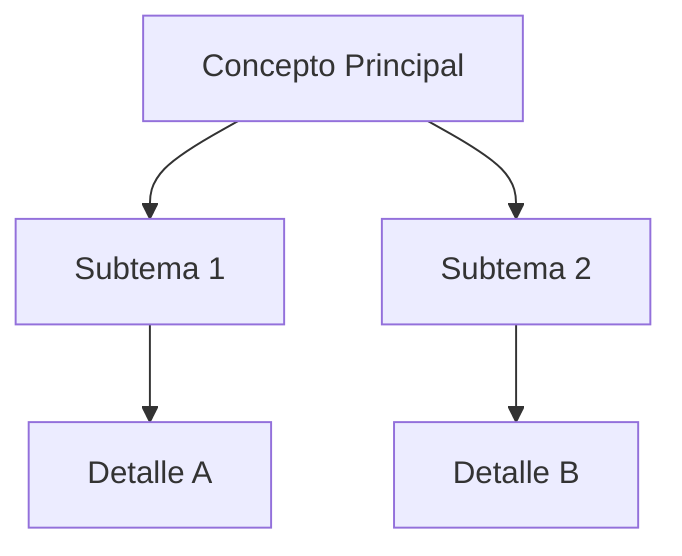

Este sección está dirigido a desarrolladores que deseen mantener, adaptar o extender el compilador de LibreScript. Abarca desde una descripción general hasta detalles sobre su arquitectura, componentes léxicos y sintácticos, errores comunes, y consideraciones para mantenimiento a futuro.

El compilador **LibreScript** es un sistema desarrollado en JavaScript con Node.js que permite analizar, validar y extender código fuente escrito en un lenguaje personalizado llamado LibreScript. El lenguaje LibreScript tiene una sintaxis inspirada en lenguajes modernos como JavaScript y Python, pero adaptado a una estructura simple que facilita su comprensión y validación en entornos académicos.

## Descripción General

El compilador está dividido en las siguientes fases principales:

1. Análisis léxico: Utiliza expresiones regulares para dividir el código en tokens significativos como palabras clave, identificadores, literales y operadores.

2. Análisis sintáctico: Utiliza reglas gramaticales para construir un árbol de sintaxis abstracta (AST) que represente la estructura jerárquica del código.

3. Análisis semántico: Recorre el AST para verificar tipos, ámbitos, definiciones de variables, tipos de retorno, y consistencia general del programa.

4. Manejo de errores: Durante cada fase, el sistema captura errores léxicos, sintácticos o semánticos y muestra mensajes claros al usuario.

Ejemplo de código con LibreScript

```ts
    funcion saludar(){
        imprimir("Hola mundo")
    }
```

Este fragmento de código define una función llamada saludar sin parámetros que imprime el mensaje Hola Mundo.


